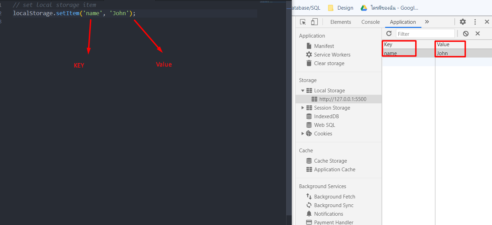

# DOM

DOM is document Object Model and javaScript can be used to read/write manipulate to the DOM. This picture can be explianed DOM very easy.


- [DOM](#dom)
- [Examining The Document object](#examining-the-document-object)
  - [setup](#setup)
  - [keep the cellection in HTML document](#keep-the-cellection-in-html-document)
  - [keep the cellection in HTML document with array](#keep-the-cellection-in-html-document-with-array)
  - [keep the length of the array](#keep-the-length-of-the-array)
  - [head](#head)
  - [body](#body)
  - [Domain](#domain)
  - [URL](#url)
  - [characterSet](#characterset)
  - [contentType](#contenttype)
  - [forms](#forms)
  - [forms array](#forms-array)
  - [forms array keep id](#forms-array-keep-id)
  - [forms array keep method](#forms-array-keep-method)
  - [forms array keep action](#forms-array-keep-action)
  - [links](#links)
  - [links keep the index of array](#links-keep-the-index-of-array)
  - [links keep the id in the index of array](#links-keep-the-id-in-the-index-of-array)
  - [links keep the classname in the index of array](#links-keep-the-classname-in-the-index-of-array)
  - [links keep the classList in the index of array](#links-keep-the-classlist-in-the-index-of-array)
  - [images](#images)
  - [script](#script)
  - [script source](#script-source)
  - [forEach loop in array](#foreach-loop-in-array)
  - [forloop loop the value in array](#forloop-loop-the-value-in-array)
  - [DOM Selector for single Elements](#dom-selector-for-single-elements)
  - [Document.getElemantById('ID')](#documentgetelemantbyidid)
  - [Get things from the element](#get-things-from-the-element)
  - [Change style](#change-style)
  - [Change content](#change-content)
  - [document.querySelector()](#documentqueryselector)
- [DOM Selector for mutiple Elements](#dom-selector-for-mutiple-elements)
  - [document.getElementsByClassName](#documentgetelementsbyclassname)
  - [document.getElementsByTagName](#documentgetelementsbytagname)
  - [conver HTML collection into array](#conver-html-collection-into-array)
  - [reverse](#reverse)
  - [forEach](#foreach)
  - [document.querySelectorAll](#documentqueryselectorall)
  - [Odd and Even](#odd-and-even)
- [Traversing The DOM](#traversing-the-dom)
  - [setup](#setup-1)
  - [Get child nodes](#get-child-nodes)
  - [Get children element nodes](#get-children-element-nodes)
  - [First child](#first-child)
  - [Last child](#last-child)
  - [Count child elements](#count-child-elements)
  - [Get parent node](#get-parent-node)
  - [Get next sibling](#get-next-sibling)
  - [Get prev sibling](#get-prev-sibling)
- [Creating Elements](#creating-elements)
  - [Create element](#create-element)
  - [Add class](#add-class)
  - [Add id](#add-id)
  - [Add attribute](#add-attribute)
  - [Create text node and append](#create-text-node-and-append)
  - [Create new link element](#create-new-link-element)
  - [Add classes](#add-classes)
  - [Add icon html](#add-icon-html)
  - [Append link into li](#append-link-into-li)
  - [Append li as child to ul](#append-li-as-child-to-ul)
  - [Removing & Replacing Elements](#removing--replacing-elements)
  - [Create Element](#create-element-1)
  - [Add id](#add-id-1)
  - [New text node](#new-text-node)
  - [Get the old heading](#get-the-old-heading)
  - [Parent](#parent)
  - [Replace](#replace)
  - [REMOVE ELEMENT](#remove-element)
  - [Remove list item](#remove-list-item)
  - [Remove child element](#remove-child-element)
  - [CLASSES & ATTR](#classes--attr)
  - [Classes](#classes)
  - [Attributes](#attributes)
- [Event Listeners & Event Object](#event-listeners--event-object)
- [Mouse Event](#mouse-event)
  - [Keyboard Event](#keyboard-event)
- [Local & Session storage](#local--session-storage)
  - [set local storage item](#set-local-storage-item)
  - [set session storage item](#set-session-storage-item)
  - [remove from storage](#remove-from-storage)
  - [get from storage](#get-from-storage)
  - [clear local storage](#clear-local-storage)
  - [Add task to local storgae](#add-task-to-local-storgae)
  - [delete task](#delete-task)

# Examining The Document object

## setup

```js
let output = document;
console.log(output);
```

## keep the cellection in HTML document

```js
output = document.all;
console.log(output);
```

## keep the cellection in HTML document with array

```js
output = document.all[1];
console.log(output);
```

## keep the length of the array

```js
output = document.all[0].length;
console.log(output);
```

## head

```js
output = document.head;
console.log(output);
```

## body

```js
output = document.body;
console.log(output);
```

## Domain

```js
output = document.domain;
console.log(output);
```

## URL

```js
output = document.URL;
console.log(output);
```

## characterSet

```js
output = document.characterSet;
console.log(output);
```

## contentType

```js
output = document.contentType;
console.log(output);
```

## forms

```js
output = document.forms;
console.log(output);
```

## forms array

```js
output = document.forms[0];
console.log(output);
```

## forms array keep id

```js
output = document.forms[0].id;
console.log(output);
```

## forms array keep method

```js
output = document.forms[0].method;
console.log(output);
```

## forms array keep action

```js
output = document.forms[0].action;
console.log(output);
```

## links

```js
output = document.links;
console.log(output);
```

## links keep the index of array

```js
output = document.links[0];
console.log(output);
```

## links keep the id in the index of array

```js
output = document.links[0].id;
console.log(output);
```

## links keep the classname in the index of array

```js
output = document.links[4].className;
console.log(output);
```

## links keep the classList in the index of array

```js
output = document.links[0].classList[0];
console.log(output);
```

## images

```js
output = document.images;
console.log(output);
```

## script

```js
output = document.scripts;
console.log(output);
```

## script source

```js
output = document.scripts[0].getAttribute("src");
console.log(output);
```

## forEach loop in array

```js
// defind script
let scripts = document.scripts;

// convert scripts to array
let scriptsArray = Array.from(scripts);

// forEach is loop for show the array
scriptsArray.forEach(function (script) {
  console.log(script.getAttribute("src"));
});
```

## forloop loop the value in array

```js
// Loop array
let allScripts = document.scripts;

let scriptsArray = Array.from(allScripts);

for (let i = 0; i < scriptsArray.length; i++) {
  console.log(scriptsArray[i].getAttribute("src"));
}

// forEach เป็นการ Loop array เพื่อนำค่าออกมาแสดง
let cars = ['Toyota', 'Honda', 'Mazda'];
console.log(cars); //[ 'Toyota', 'Honda', 'Mazda' ]

cars.forEach(function (car) {
    console.log(car);
    // Toyota
    // Honda
    // Mazda
});
```

## DOM Selector for single Elements

## Document.getElemantById('ID')

`document.getElementById(``);` จะสามารถเลือกได้เฉพาะ id เท่านั้น ไม่สามารถเลือกอย่างอื่นได้ 

```js
document.getElementById("main");
```

## Get things from the element

```js
document.getElementById("main").id;
console.log(document.getElementsByClassName("card-content")[0]);
```

## Change style

```js
document.getElementById("task-title").style.background = "#333";
document.getElementById("task-title").style.color = "#fff";
document.getElementById("task-title").style.padding = "5px";
document.getElementById("task-title").style.textTransform = "uppercase";
```

## Change content

```js
document.getElementById("task-title").textContent = "Task List";
document.getElementById("task-title").innerText = "My task";
document.getElementById("task-title").innerHTML =
  '<span style="color:red">Task List</span>';
```

## document.querySelector()

```js
document.querySelector("#task-title"); // query selector by ID
document.querySelector(".card-title"); // query selector by className
document.querySelector("h5"); // query selector by HTML Tag
```

# DOM Selector for mutiple Elements

Get Elements

| No  | Syntex                 | Description                                                 |
| --- | ---------------------- | ----------------------------------------------------------- |
| 1   | getElementById         | เลือกเฉพาะ ID เท่านั้น                                          |
| 2   | getElementsByClassName | เลือกเฉพาะ ClassName เท่านั้น                                   |
| 3   | querySelector          | เลือกได้ทั้ง id, className, HTML tag แต่จะได้เฉพาะ Firstchild     |
| 4   | querySelectorAll       | เลือกได้ทั้ง id, className, HTML tag แต่จะ Return เป็น Node Lists |

## document.getElementsByClassName

```js
let items = document.getElementsByClassName("collection-item");
console.log(items);
```

## document.getElementsByTagName

```js
let lis = document.getElementsByTagName("li");
console.log(lis);
console.log(lis[0]);
lis[0].style.color = "red";
lis[3].textContent = "Hello";
```

## conver HTML collection into array

```js
lis = Array.from(lis);
```

## reverse

```js
lis.reverse();
console.log(lis);
```

## forEach

```js
lis.forEach(function (li, index) {
  li.textContent = `${index}: Hello`;
});
```

## document.querySelectorAll

```js
document.querySelectorAll;
const items = document.querySelectorAll("ul.collection li.collection-item");
console.log(items);

items.forEach(function (item, index) {
  item.textContent = `${index}: Hello`;
});
```

## Odd and Even

```js
const liOdd = document.querySelectorAll("li:nth-child(odd)");
const liEven = document.querySelectorAll("li:nth-child(even)");

liOdd.forEach(function (li) {
  li.style.background = "#ccc";
});

liEven.forEach(function () {
  li.style.background = "#fff";
});
```

# Traversing The DOM

| Number    | Description           |
| --------- | --------------------- |
| Header    | Title                 |
| number 1  | Element               |
| number 2  | Attribute(deprecated) |
| number 3  | Text nodes            |
| number 8  | comment               |
| number 9  | Document itself       |
| number 10 | Doctype               |

## setup

```js
let val;

const list = document.querySelector("ul.collection");
const listItem = document.querySelector("li.collection-item:first-child");

val = listItem;
val = list;
```

## Get child nodes

```js
val = list.childNodes;
val = list.childNodes[0];
val = list.childNodes[0].nodeName;
val = list.childNodes[3].nodeType;
```

## Get children element nodes

```js
val = list.children;
val = list.children[1];
list.children[1].textContent = "Hello";
// Children of children
list.children[3].children[0].id = "test-link";
val = list.children[3].children[0];
```

## First child

```js
val = list.firstChild;
val = list.firstElementChild;
```

## Last child

```js
val = list.lastChild;
val = list.lastElementChild;
```

## Count child elements

```js
val = list.childElementCount;
```

## Get parent node

```js
val = listItem.parentNode;
val = listItem.parentElement;
val = listItem.parentElement.parentElement;
```

## Get next sibling

```js
val = listItem.nextSibling;
val = listItem.nextElementSibling.nextElementSibling.previousElementSibling;
```

## Get prev sibling

```js
val = listItem.previousSibling;
val = listItem.previousElementSibling;
console.log(val);
```

# Creating Elements

## Create element

```js
const li = document.createElement("li");
```

## Add class

```js
li.className = "collection-item";
```

## Add id

```js
li.id = "new-item";
```

## Add attribute

```js
li.setAttribute("title", "New Item");
```

## Create text node and append

```js
li.appendChild(document.createTextNode("Hello World"));
```

## Create new link element

```js
const link = document.createElement("a");
```

## Add classes

```js
link.className = "delete-item secondary-content";
```

## Add icon html

```js
link.innerHTML = '<i class="fa fa-remove"></i>';
```

## Append link into li

```js
li.appendChild(link);
```

## Append li as child to ul

```js
document.querySelector("ul.collection").appendChild(li);
```

## Removing & Replacing Elements

## Create Element

```js
const newHeading = document.createElement("h2");
```

## Add id

```js
newHeading.id = "task-title";
```

## New text node

```js
newHeading.appendChild(document.createTextNode("Task List"));
```

## Get the old heading

```js
const oldHeading = document.getElementById("task-title");
```

## Parent

```js
const cardAction = document.querySelector(".card-action");
```

## Replace

```js
cardAction.replaceChild(newHeading, oldHeading);
```

## REMOVE ELEMENT

```js
const lis = document.querySelectorAll("li");
const list = document.querySelector("ul");
```

## Remove list item

```js
lis[0].remove();
```

## Remove child element

```js
list.removeChild(lis[3]);
```

## CLASSES & ATTR

```js
const firstLi = document.querySelector("li:first-child");
const link = firstLi.children[0];
```

## Classes

```js
val = link.className;
val = link.classList;
val = link.classList[0];
link.classList.add("test");
link.classList.remove("test");
val = link;
```

## Attributes

```js
val = link.getAttribute("href");
val = link.setAttribute("href", "http://google.com");
link.setAttribute("title", "Google");
val = link.hasAttribute("title");
link.removeAttribute("title");
val = link;
```

# Event Listeners & Event Object

| Event       | Description                                        |
| ----------- | -------------------------------------------------- |
| Header      | Title                                              |
| onChange    | An HTML element has been changed                   |
| onClick     | The user clicks an HTML element                    |
| onmouseover | The user moves the mouse over an HTML element      |
| onmouseout  | The user moves the mouse away from an HTML element |
| onkeydown   | The user pushes a keyboard key                     |
| onload      | The browser has finished loading the page          |

# Mouse Event

```js
// Click
clearBtn.addEventListener("click", runEvent);
// Doubleclick
clearBtn.addEventListener("dblclick", runEvent);
// Mousedown
clearBtn.addEventListener("mousedown", runEvent);
// Mouseup
clearBtn.addEventListener("mouseup", runEvent);
// Mouseenter
card.addEventListener("mouseenter", runEvent);
// Mouseleave
card.addEventListener("mouseleave", runEvent);
// Mouseover
card.addEventListener("mouseover", runEvent);
// Mouseout
card.addEventListener("mouseout", runEvent);
// Mousemove
card.addEventListener("mousemove", runEvent);

// Event Handler
function runEvent(e) {
  console.log(`EVENT TYPE: ${e.type}`);

  heading.textContent = `MouseX: ${e.offsetX} MouseY: ${e.offsetY}`;

  document.body.style.backgroundColor = `rgb(${e.offsetX}, ${e.offsetY}, 40)`;
}
```

## Keyboard Event

```js
const form = document.querySelector("form");
const taskInput = document.getElementById("task");
const heading = document.querySelector("h5");
const select = document.querySelector("select");

// Clear input
taskInput.value = "";

form.addEventListener("submit", runEvent);

// Keydown
taskInput.addEventListener("keydown", runEvent);
// Keydown
taskInput.addEventListener("keyup", runEvent);
// Keypress
taskInput.addEventListener("keypress", runEvent);
// Focus
taskInput.addEventListener("focus", runEvent);
// Blur
taskInput.addEventListener("blur", runEvent);
// Cut
taskInput.addEventListener("cut", runEvent);
// Paste
taskInput.addEventListener("paste", runEvent);
// Input
taskInput.addEventListener("input", runEvent);
// Change
select.addEventListener("change", runEvent);

function runEvent(e) {
  console.log(`EVENT TYPE: ${e.type}`);

  //console.log(e.target.value);

  // heading.innerText = e.target.value;

  // Get input value
  // console.log(taskInput.value);

  // e.preventDefault();
}
```

# Local & Session storage



1. If we use `localstorage.setItem('name', 'John');` this one can storage in the web browser.
2. But if we use `sessionStorage.setItem('name', 'Brown');` this one can not storage in the web browser.

## set local storage item

```js
localStorage.setItem("name", "John");
localStorage.setItem("age", "30");
```

## set session storage item

```js
sessionStorage.setItem("name", "Beth");
```

## remove from storage

```js
localStorage.removeItem("name");
```

## get from storage

```js
const name = localStorage.getItem("name");
const age = localStorage.getItem("age");
```

## clear local storage

```js
localStorage.clear();
```

## Add task to local storgae

```js
document.querySelector("form").addEventListener("submit", function (e) {
  const task = document.getElementById("task").value;

  let tasks;

  if (localStorage.getItem("tasks") === null) {
    tasks = [];
  } else {
    tasks = JSON.parse(localStorage.getItem("tasks"));
  }

  tasks.push(task);

  localStorage.setItem("tasks", JSON.stringify(tasks));

  alert("Task saved");

  e.preventDefault();
});

const tasks = JSON.parse(localStorage.getItem("tasks"));

tasks.forEach(function (task) {
  console.log(task);
});
```

## delete task

```js
document.body.addEventListener("click", deleteItem);

function deleteItem(e) {
  if (e.target.parentElement.classList.contains("delete-item")) {
    e.target.parentElement.parentElement.remove();
  }
}
```
