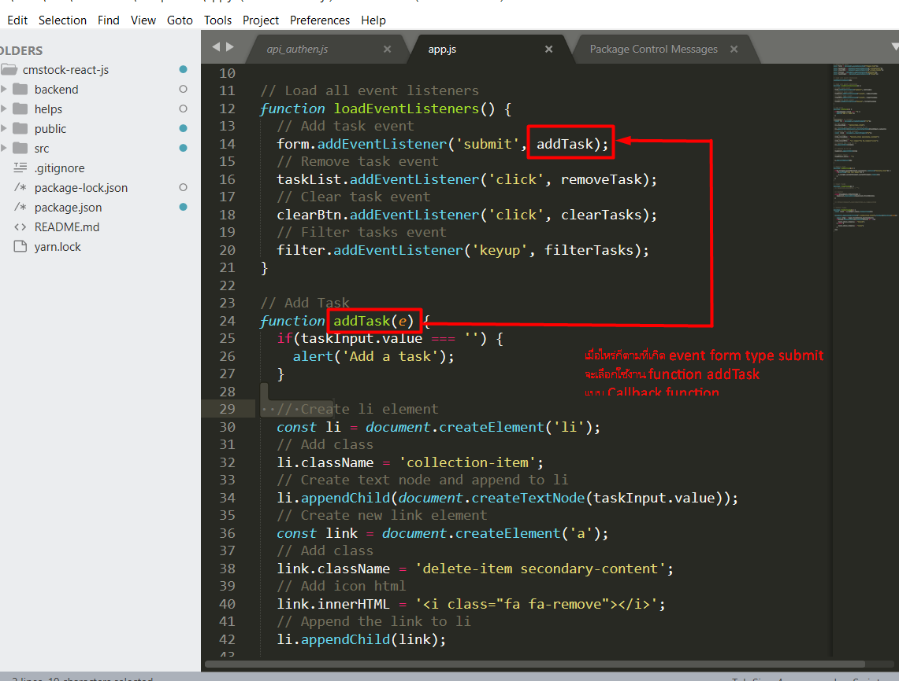
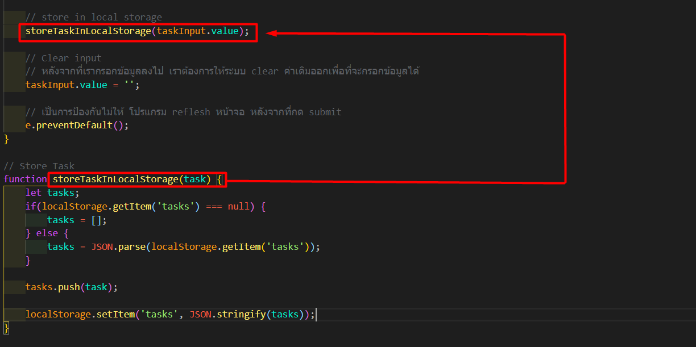

# DOM To do list project

## javaScript method

- addEventListener () วิธีการที่ใช้ในการเพิ่มตัวจัดการเหตุการณ์ที่จะเป็นองค์ประกอบที่ระบุ หรือว่า วิธีการเพิ่มตัวจัดการเหตุการณ์ไม่เขียนทับตัวจัดการเหตุการณ์ที่มีอยู่
- e.preventDefault() เอาไว้ Cancel event ที่จะเกิดขึ้น เช่นเวลาเรากดปุ่ม submit form มันจะ refresh หน้า แต่เราไม่ต้องการให้มัน refresh หน้า
- innerHTML เป็นการแทรก HTML Tag ลงไปในตำแหน่งที่ต้องการ
- appendChild ใช้สำหรับแทรก element ใดๆ ลงใน element ที่กำหนด โดย element ที่แทรกจะเป็น โหนดลูก (child node) ของ element ที่แทรก
- contains() เป็นการตรวจสอบว่าภายใน Hashtable ในมี key, value นั้นอยู่่หรือเปล่า
- forEach ใช้เพื่อการ วนลูป รอบอาร์เรย์ โดยหลักการแล้วเราใช้เพื่อเข้าถึงแต่ละ Element ภายใน Array
- != -1 ความหมายคือ ถ้าไม่เท่ากับ
- .querySelectorAll จะ return node list ออกมา

## e.preventDefault

ป้องกัน event ที่เราไม่ต้องการให้เกิดอัตโนมัติ

```js
// e.preventDefault
function handleOnSubmit(event) {
   event.preventDefault()
}

<form onSubmit={handleOnSubmit} >
 <button type"submit"> submit form </button>
</form>

```

## addEventListener

ตัวจัดการ eventต่างๆ ที่เราต้องการ



## Store task into local storage



```js
// Store Task
function storeTaskInLocalStorage(task) {
  let tasks;
  // สร้างตัวแปร tasks ขึ้นมาเพื่อทำการเช็คค่าว่า ค่าที่ส่งเข้ามาเป็นค่าว่างหรือว่ามีค่าหรือไม่
  // สร้าง if else statment ขึ้นมาเพื่อตรวจเช็คค่าว่า เป็นค่าว่างหรือไม่
  // ถ้าเป็นค่าว่าง ให้ส่งค่าเป็น Array เปล่าออกไป
  // ถ้าไม่เป็นค่าว่าง ให้เรียกใช้ method push ส่งค่าเข้าไปใน array ของ local storage
  // Local storage สามารถเก็บค่าได้เฉพาะ string เท่านั้น ดังนั้นเราจะต้องใช้ JSON.parse เพื่อแปลงเป็น String เพื่อส่งค่าไปที่ Local DB
  // จากนั้นเราจะต้องส่งค่าไปที่ Local DB ด้วย JSON.stringify() เพื่อใหสามารถอ่านค่าได้
  if (localStorage.getItem("tasks") === null) {
    tasks = [];
  } else {
    tasks = JSON.parse(localStorage.getItem("tasks"));
  }

  tasks.push(task);

  localStorage.setItem("tasks", JSON.stringify(tasks));
}
```
