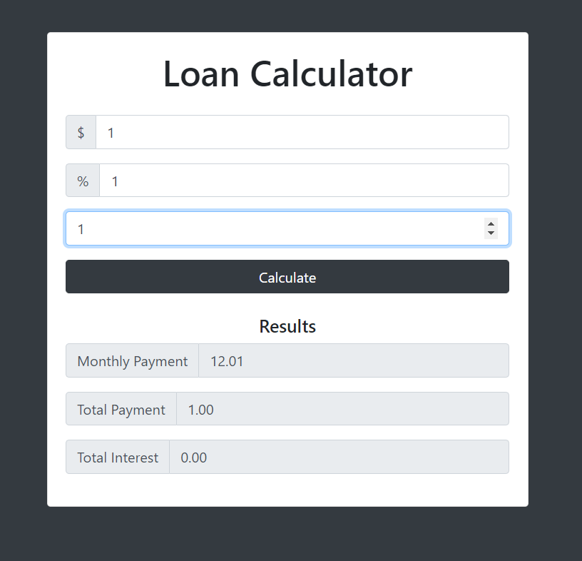

<div align="center">
    
</div>

# Loan calculate

## javaScript

- `getElementById()` คือการเข้าถึง tag Element ใน html ใช้ในการจัดการกับ object element ต่างๆ เพื่อการดักจับ Event ต่างๆ
- `parseFloat` Convert string to number คือการแปลง string ให้เป็น Number แล้วได้ข้อมูลเป็นทศนิยมจุดลอย
- `Math.pow` ใช้หาค่ายกกำลัง
- `isFinite` เป็นฟังก์ชั่นที่ค่อยตรวจสอบว่าตัวเลขนั้นเป็นจำนวนจำกัดหรือไม่
- `toFixed` เป็นตัวกำหนดว่าเราต้องการทศนิยมจำนวนกี่ตัว
- `setTimeout(callback function, time mini second);` หลังจากที่เราเรียกใช้ function ที่ต้องการแล้ว เราอยากให้มันหายไปภายในกี่วินาที
- `document.getElementById('results').style.display = 'none';` เป็นการจัดการ element ว่าเราต้องการให้ Element นั้นไม่แสดงในตอนนี้
- `document.getElementById('loading').style.display = 'block';` เป็นการจัดการ element ว่าเราต้องการให้ Element นั้นให้แสดงในตอนนี้

## อธิบาย Code

```js
// เราเข้าถึง Element ด้วยคำสั่ง getElementById('id')จากนั้นเพิ่มตัวจัดการ Evenet  ด้วยคำสั่ง addEventListener('javaScript Event' function)
document.getElementById("loan-form").addEventListener("submit", function (e) {
  // Hide
  // getElementById('id') จากนั้นเราก็เพิ่ม style css.property = 'ค่าที่ต้องการ'
  document.getElementById("results").style.display = "none";

  // Show loader
  // getElementById('id') จากนั้นเราก็เพิ่ม style css.property = 'ค่าที่ต้องการ'
  document.getElementById("loading").style.display = "block";

  // setTimeOut
  // เป็นการเซตค่าในการเรียก function, เวลาที่ต้องการมีหน่วยเป็นวินาที
  setTimeout(calculateResults, 2000);

  e.preventDefault();
});
```

```js
function calculateResults() {
  // UI variable and getElementById from html
  const amount = document.getElementById("amount");
  const interest = document.getElementById("interest");
  const years = document.getElementById("years");
  const monthlyPayment = document.getElementById("monthly-payment");
  const totalPayment = document.getElementById("total-payment");
  const totalInterest = document.getElementById("total-interest");

  const principle = parseFloat(amount.value);
  const calculatedInterest = parseFloat(interest.value) / 100 / 12;
  const calculatedPayments = parseFloat(years.value) / 12;

  // compute monthly payment
  const x = Math.pow(1 + calculatedInterest, calculatedPayments);
  const monthly = (principle * x * calculatedInterest) / (x - 1);

  if (isFinite(monthly)) {
    monthlyPayment.value = monthly.toFixed(2);
    totalPayment.value = (monthly * calculatedPayments).toFixed(2);
    totalInterest.value = (monthly * calculatedPayments - principle).toFixed(2);

    // Show results
    document.getElementById("results").style.display = "block";

    // Hide loader
    document.getElementById("loading").style.display = "none";
  } else {
    showError("Please check your number");
  }
}
```
