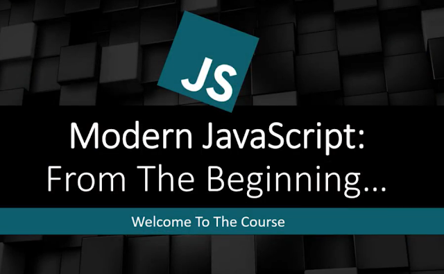

  
  <h1 > Modern JavaScrip from the beginning </h1> 

**Pages**

- [Page 1 : Fundamental](https://github.com/Wissanukhong/Modern-JavaScript-from-the-Biginning/blob/master/1.Fundamentals/fundamental.md)
- [Page 2 : DOM](https://github.com/Wissanukhong/Modern-JavaScript-from-the-Biginning/blob/master/2.Dom/DOM.md)
- [Page 3 : DOM project](https://github.com/Wissanukhong/Modern-JavaScript-from-the-Biginning/blob/master/3.DOMproject/DOMproject.md)
  - [To do list](https://github.com/Wissanukhong/Modern-JavaScript-from-the-Biginning/blob/master/3.DOMproject/1.todolist/DOMproject.md)

[This is my summary javaScript cheat sheet](https://docs.google.com/spreadsheets/d/15doGb6DQk_ULSSX6rGCPuz110nyPoUi35FM1fwBvT_s/edit?usp=sharing) 💾

## introduction to javascript💡

1. Basics & Fundamentals: Data types, let & const variables, functions, conditionals, loops, object literals, arrays, etc
2. DOM Manipulation: Selectors, traversing the DOM, show / hide, creating & removing elements, event listeners
3. OOP: ES5 prototypes, inheritance, ES2015 classes & sub - classes, constructors
4. Async JS: Ajax & XHR, Fetch API, callbacks, promises, async /await ES2015 +: Arrow functions, template strings, generators, iterators, maps & sets, symbols & more
5. JavaScript Patterns: Module, Factory, State, Observer, Mediator, Singleton Other: Local & session storage, regular expressions, try catch error handling 7. 10 Projects of all kinds
